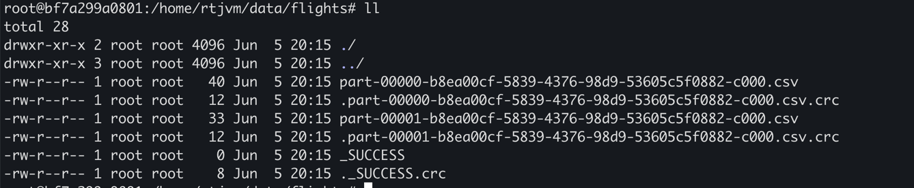

### Spark SQL

Use spark as a "Big Data" database.

#### SQL

- **Universal standard for accessing structured data**.
- **Abstraction over DataFrames for engineers familiar with databases**.
- **Supported in Spark**.
    - Programmatically in expressions.
    - In the spark shell.
- **Spark SQL**.
    - Has the concept of "database", "table", "view".
    - Allows access to DataFrames as tables.
- **DataFrame vs Table**.
    - Identical in terms of storage and partitioning.
    - DataFrames can be processed programmatically, tables in SQL.

#### Examples

- `/bin/spark-sql`
- `spark-sql> show databases;`
- `spark-sql> create database rtjvm;`
- `spark-sql> use rtjvm;`
- `spark-sql> create table persons(id integer, name string);`
- `spark-sql> select * from persons;`
- `spark-sql> insert into persons values (1, "Martin Odersky"), (2, "Matei Zaharia");`

Difference between managed table and external table:

#### Managed Table

- `spark-sql> describe extended persons`
- Managed table means the spark is in charge of the metadata of this table. 
- That's the description where the table is, what the columns are, what the schema is.
- Spark is in charge of the data.
- `spark-sql> drop table persons`
- If you drop datable, it will drop the metadata, the description on the data, you will actually lose the data.
- A managed table looks like folders (tables) inside the (spark/spark cluster?) and the content of tables are files (partitioned).

#### External Table
- Spark is in charge of the metadata only.
- If you drop the table, you keep the data. But the data is your responsibility.
- `spark-sql> create table flights(origin string, destination string) using csv options(header true, path "/home/rtjvm/data/flights");`
- `spark-sql> insert into flights values ("Los Angeles", "New York"), ("London", "Prague");`

Table located in "/home/rtjvm/data/flights" looks like:

