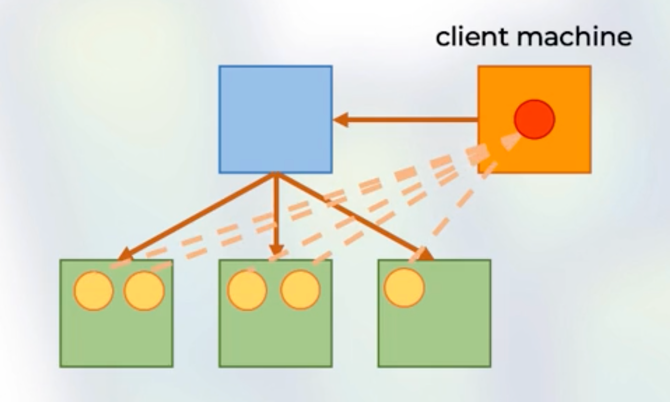

## The anatomy of a cluster

### Spark cluster manager:

- One node manages the state of the cluster.
- The others do the work.
- Communicate via driver/worker processes.

A cluster would look like.
The blue one is the node who manages the other workers (green ones).

- Manager Node: Blue Box
- Worker Node: Green Boxes

### Sparks supports 3 cluster managers:

- Standalone
- YARN
- Apache Mesos

### Spark driver

- Manages the state of the stages/tasks of the application.
- Interfaces with the cluster manager

### Spark executors

- Run the tasks assigned by the spark driver.
- Report their states and results to the driver.

the Driver would be the red circle.

- Driver: Red circle
- Executor: Yellow circles

## Execution modes

We can launch an application in

#### Cluster:

- Spark driver is launched in worker node.
- The cluster manager is responsible for Spark process.

#### Client

- The Spark driver is on the client machine.
- The client is responsible for Spark processes and the state management.

#### Local

- The entire application runs on the same machine.